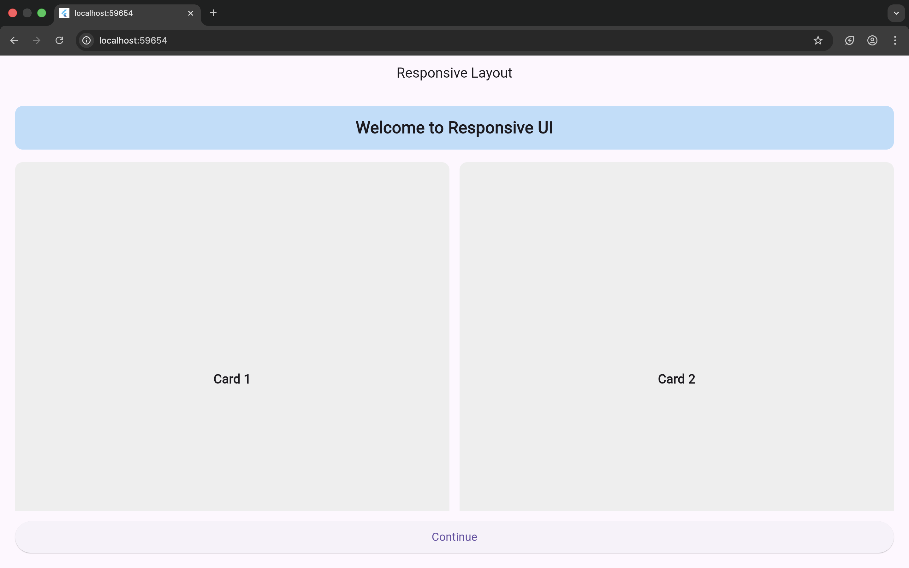
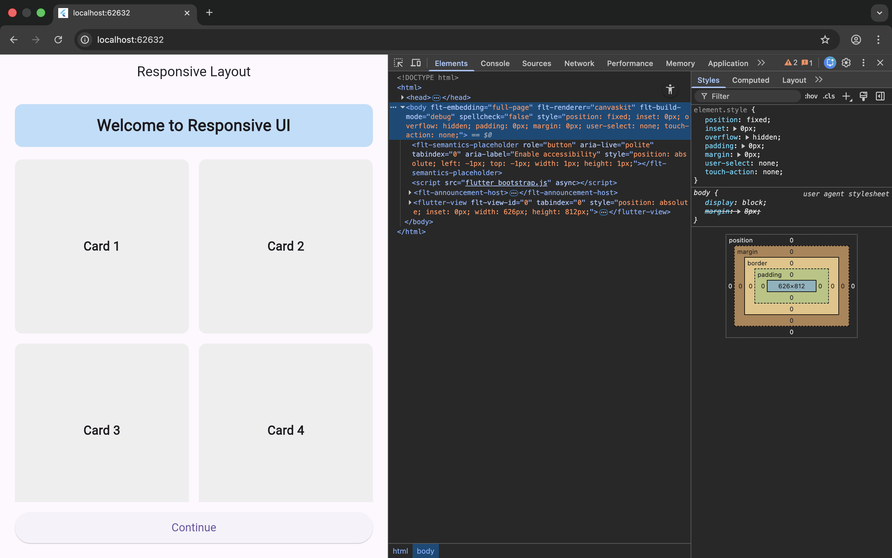
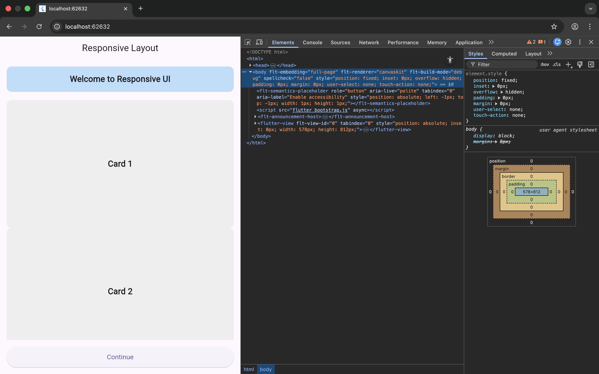

# Responsive Flutter Layout Demo

## Overview
This project demonstrates how to build a responsive Flutter UI that adapts to different screen sizes and orientations using MediaQuery and adaptive widgets.

## Features
- Single-column layout for phones
- Two-column grid layout for tablets
- Responsive text sizing and padding
- Works in portrait and landscape modes

## MediaQuery Usage
```dart
double screenWidth = MediaQuery.of(context).size.width;
bool isTablet = screenWidth > 600;
```

## Widgets Used

- MediaQuery

- GridView

- Expanded

- Flexible

- AspectRatio

- FittedBox

## Screenshots





