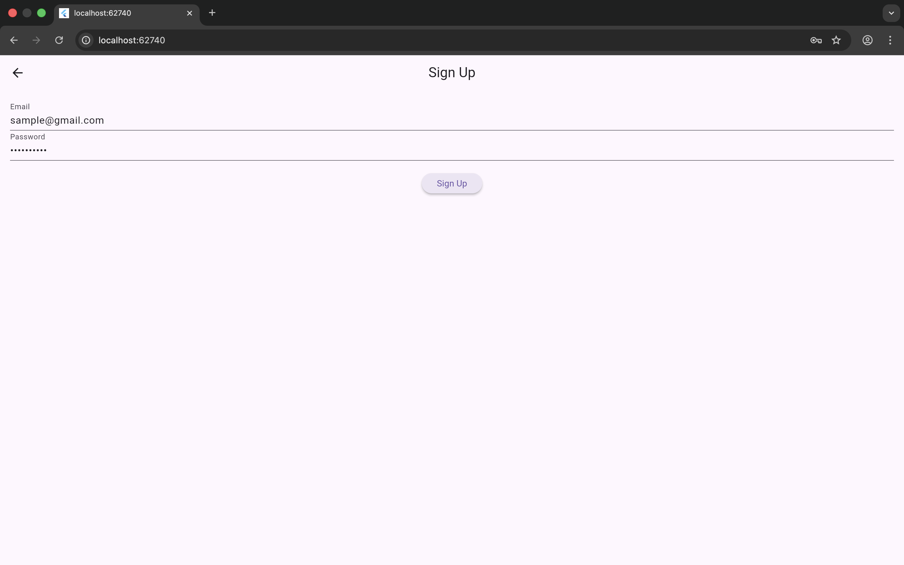
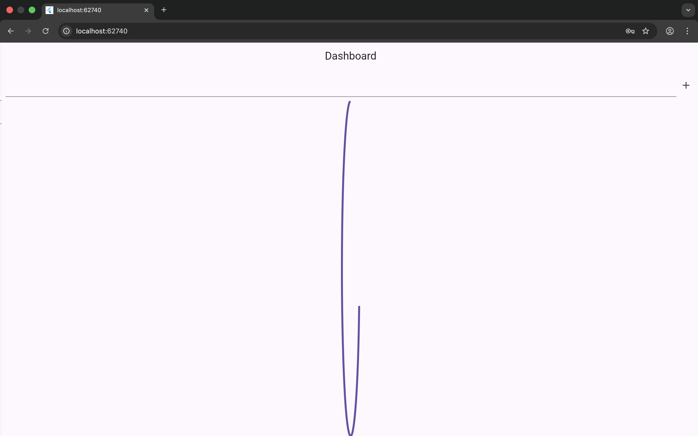
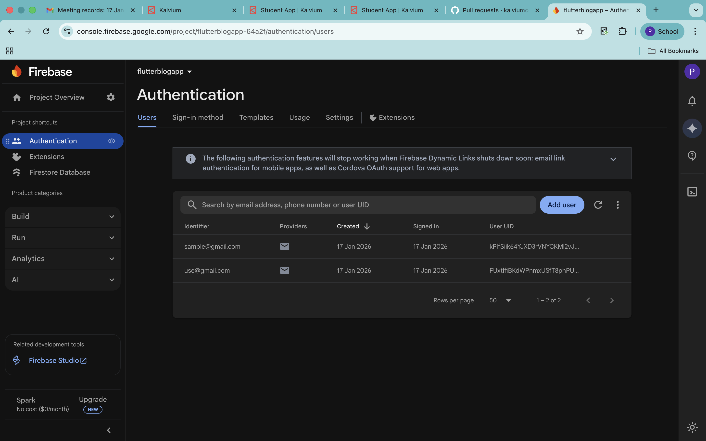

# Flutter Firebase Authentication & Firestore Integration

## Project Overview
This project demonstrates the integration of **Firebase Authentication** and **Cloud Firestore** in a Flutter application.  
The app allows users to **sign up, log in, and log out** using email and password authentication.  
After logging in, users can **add, view, and delete data in real time** using Firestore.

This project showcases how Firebase can be used as a backend service for authentication and real-time data storage in Flutter applications.

---

## Firebase Features Implemented
- Email & Password Authentication using Firebase Authentication
- Real-time data storage using Cloud Firestore
- CRUD operations (Create, Read, Delete)
- Live updates using StreamBuilder

---

## Setup Instructions

### 1. Firebase Project Setup
1. Create a project in **Firebase Console**
2. Add Android app to Firebase project
3. Download `google-services.json`
4. Place it inside: android/app/


### 2. Enable Firebase Services
- Enable **Email/Password Authentication**
- Enable **Cloud Firestore** (Test Mode)

---

### 3. FlutterFire Configuration
Run the following commands:

```bash
dart pub global activate flutterfire_cli
flutterfire configure
```

This generates:
```bash
lib/firebase_options.dart
```

### 4. Dependencies Used
```bash
dependencies:
  firebase_core: ^3.0.0
  firebase_auth: ^5.0.0
  cloud_firestore: ^5.0.0
```

### 5. Firebase Initialization
```bash
await Firebase.initializeApp(
  options: DefaultFirebaseOptions.currentPlatform,
);
```

## Authentication Logic (Code Snippet)

```bash
Future<User?> login(String email, String password) async {
  try {
    final result = await FirebaseAuth.instance
        .signInWithEmailAndPassword(
          email: email,
          password: password,
        );
    return result.user;
  } catch (e) {
    return null;
  }
}
```

## Firestore Logic (Code Snippet)
```bash
Future<void> addNote(String text) async {
  await FirebaseFirestore.instance
      .collection('notes')
      .add({'text': text});
}
```

### Screenshots









### Testing Performed

Created a new user using Signup screen

Logged in using registered credentials

Added records to Firestore

Verified real-time updates in Firebase Console