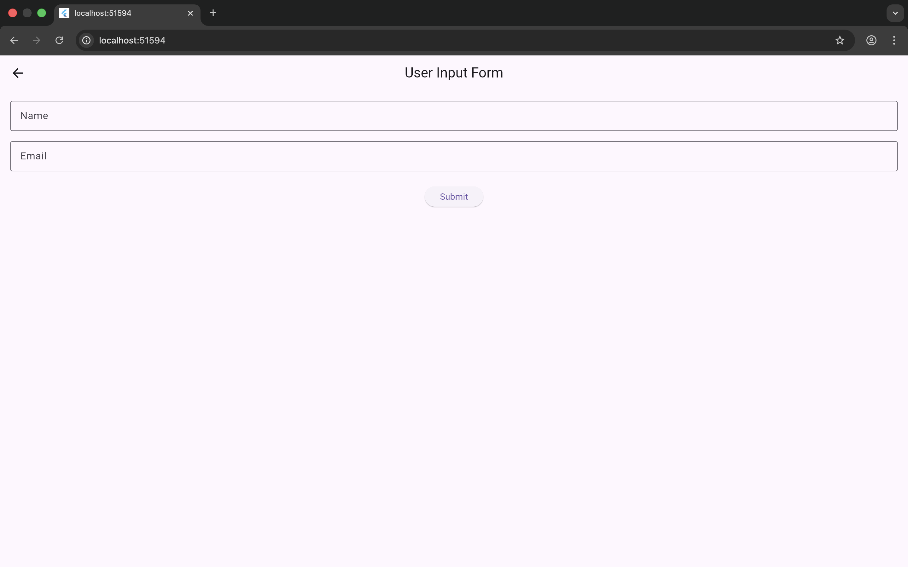
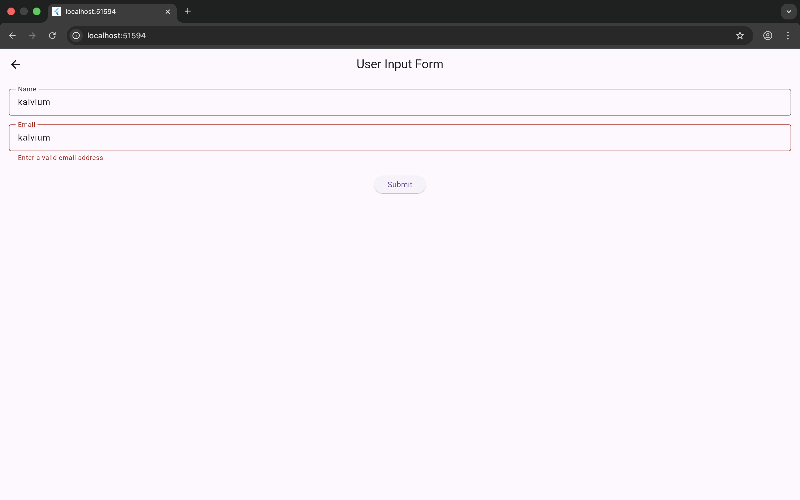
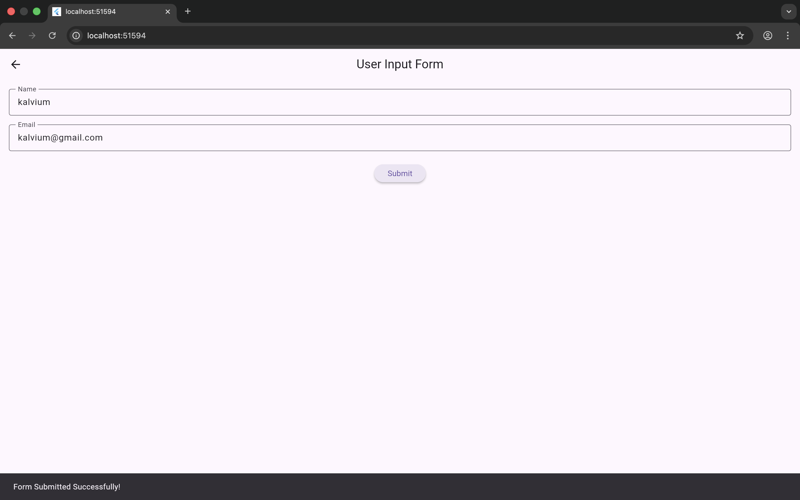

# Flutter Blog App – User Input Form & Authentication

## Project Description

The **User Input Form**, demonstrates how to collect and validate user input using Flutter’s `Form` and `TextFormField` widgets.

---

## Features Implemented
- User Login UI with Email and Password fields
- Navigation between multiple screens using `Navigator`
- User Input Form with validation
- Feedback using `SnackBar`
- Clean and modern UI design

---

## User Input Form Feature

The **User Input Form** is accessible from the **Login Screen** under the *Explore Features* section.

### Widgets Used
- `TextFormField` – for name and email input
- `Form` – to manage validation logic
- `GlobalKey<FormState>` – to track form state
- `ElevatedButton` – to submit the form
- `SnackBar` – to show success messages

---

## Code Snippet (Validation Example)

```dart
TextFormField(
  decoration: InputDecoration(labelText: 'Email'),
  validator: (value) {
    if (value == null || value.isEmpty) {
      return 'Please enter your email';
    }
    if (!value.contains('@')) {
      return 'Enter a valid email address';
    }
    return null;
  },
);
```

## Reflection

### Why is input validation important in mobile applications?

Input validation ensures that users enter correct and meaningful data. It improves app reliability, prevents incorrect submissions, and enhances user experience.

### Difference between TextField and TextFormField?

- TextField: Used for simple text input without built-in validation.

-TextFormField: Works with the Form widget and supports validation using the validator property.

### How does form state management simplify validation?

Using GlobalKey<FormState> allows validation of all form fields together. It simplifies checking input values and handling form submission efficiently.

## Screenshots

User Input Form (Before Input)


Validation Error Messages


Successful Form Submission
