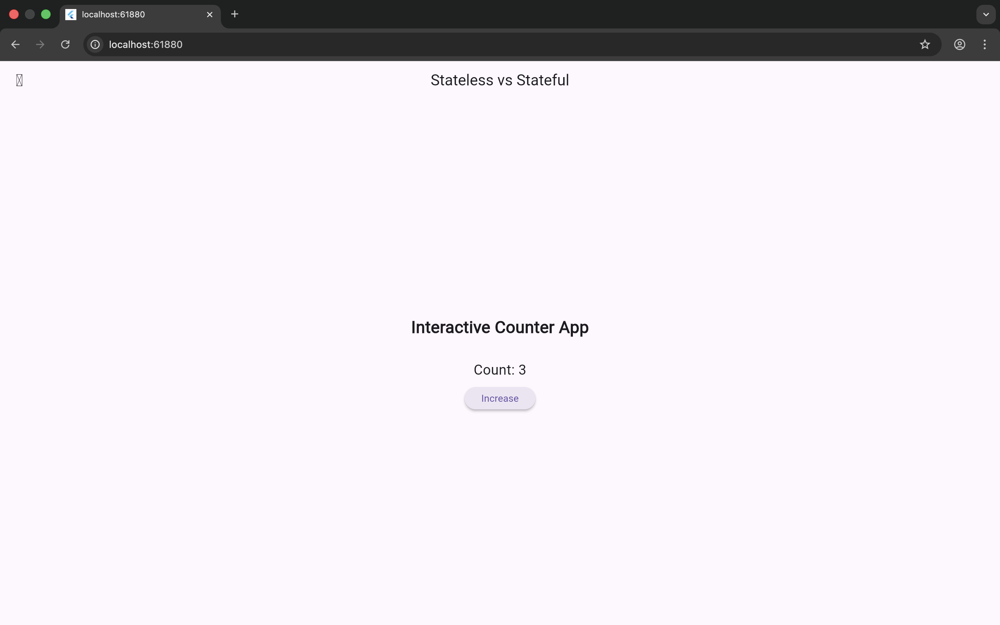

# Creating and Using Stateless and Stateful Widgets

This Flutter app demonstrates the difference between Stateless and Stateful widgets using a simple counter example.

## Explanation

### Stateless Widget
A StatelessWidget does not hold any mutable state.
It is used for static UI elements like titles or labels.

### Stateful Widget
A StatefulWidget maintains state that can change during runtime.
It rebuilds the UI using setState().

## Code Snippets

### Stateless Widget Example
```dart
class DemoHeader extends StatelessWidget {
  @override
  Widget build(BuildContext context) {
    return Text('Interactive Counter App');
  }
}
```

### Stateful Widget Example
```dart
class CounterSection extends StatefulWidget {
  @override
  State<CounterSection> createState() => _CounterSectionState();
}
```

## Screenshots

### Initial UI


### After Button Click



## Reflection

Stateful widgets make Flutter apps dynamic by allowing the UI to react to user interactions.
Separating static and reactive UI improves performance, readability, and maintainability.