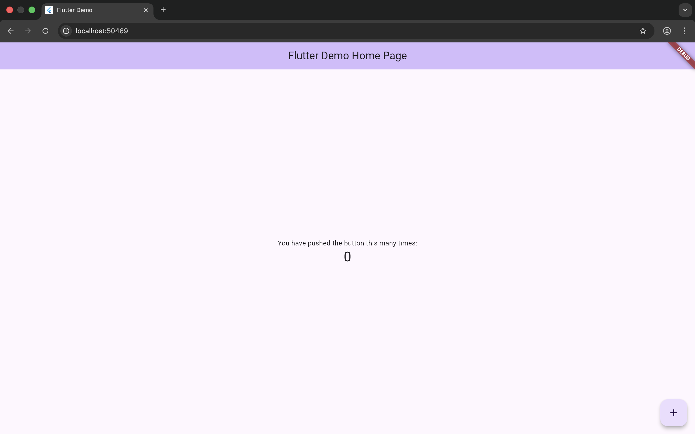

# Understanding the Widget Tree and Flutter's Reactive UI Model

This project demonstrates Flutter’s widget tree structure and reactive UI model using a simple counter application.

## Widget Tree Hierarchy

MaterialApp  
 ┗ Scaffold  
    ┣ AppBar  
    ┗ Body  
       ┗ Center  
          ┗ Column  
             ┣ Text  
             ┗ ElevatedButton  

## Screenshots

### Initial UI State

### After State Update

## What is a Widget Tree?
A widget tree is the hierarchical structure of widgets in Flutter. Every UI element in Flutter is a widget, and widgets are nested inside each other to form the UI.

## How does the Reactive Model work in Flutter?
Flutter uses a reactive UI model. When the state changes using `setState()`, Flutter rebuilds the widgets that depend on that state.

## Why does Flutter rebuild only parts of the UI?
Flutter optimizes performance by rebuilding only the widgets whose state has changed instead of redrawing the entire screen.
