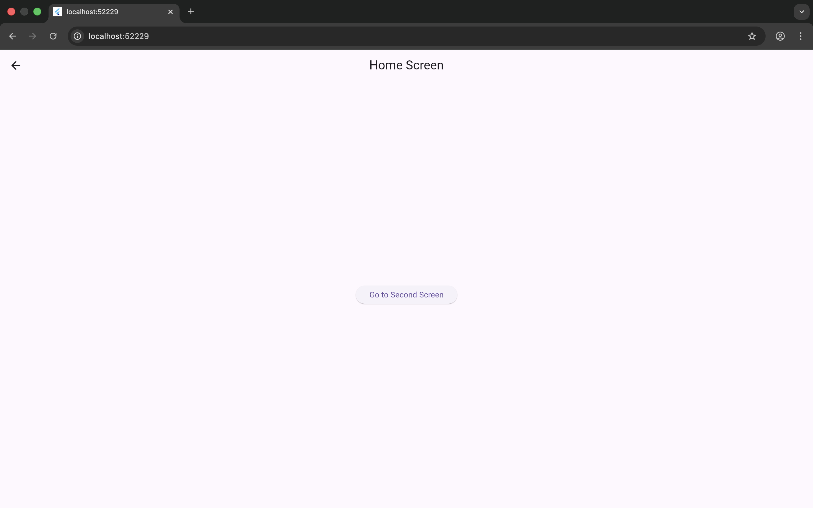
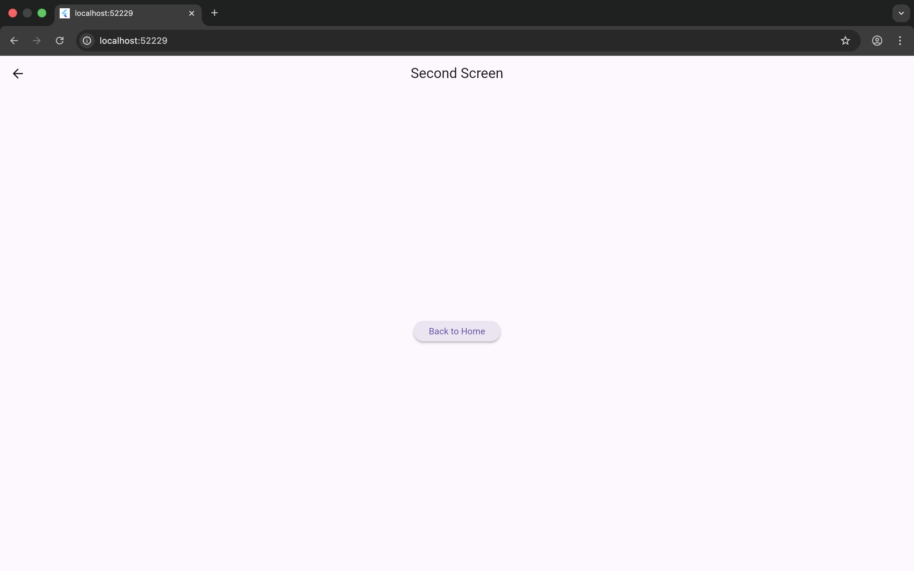
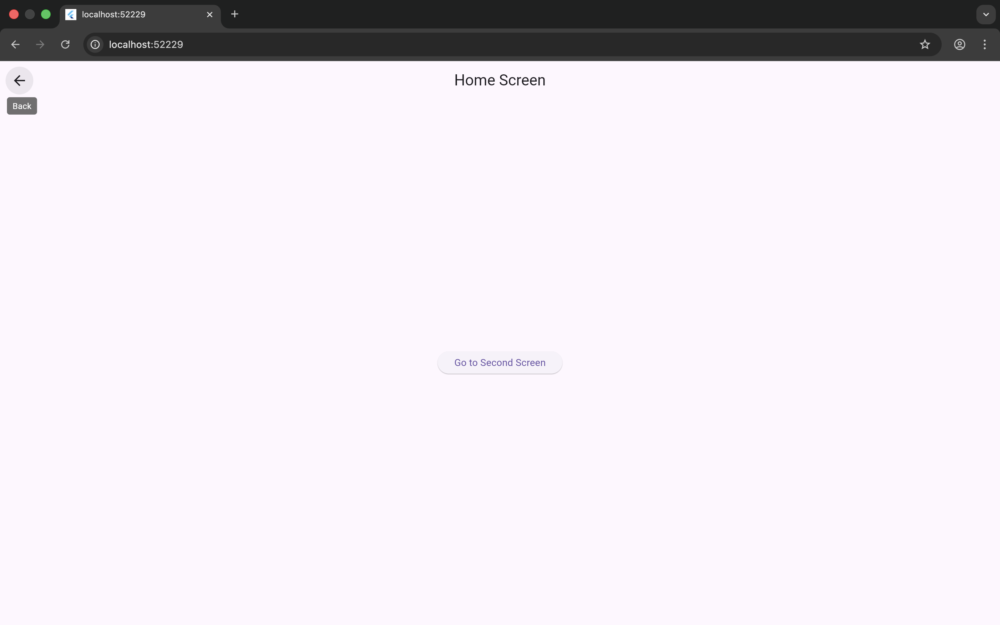

# Structuring Multi-Screen Navigation Using Navigator and Routes

## Summary
This project demonstrates multi-screen navigation in Flutter using
Navigator and named routes.

## Screens
- HomeScreen
- SecondScreen

## Navigation
- Navigator.pushNamed() used to navigate forward
- Navigator.pop() used to return to previous screen

## Routes
Routes are defined in main.dart using MaterialApp routes map.

## Screenshots

- Home Screen

- Second Screen

- Navigation flow

## Reflection
Navigator manages screens using a stack structure where new screens
are pushed and popped.

Named routes improve scalability and readability in large applications
by centralizing navigation logic.