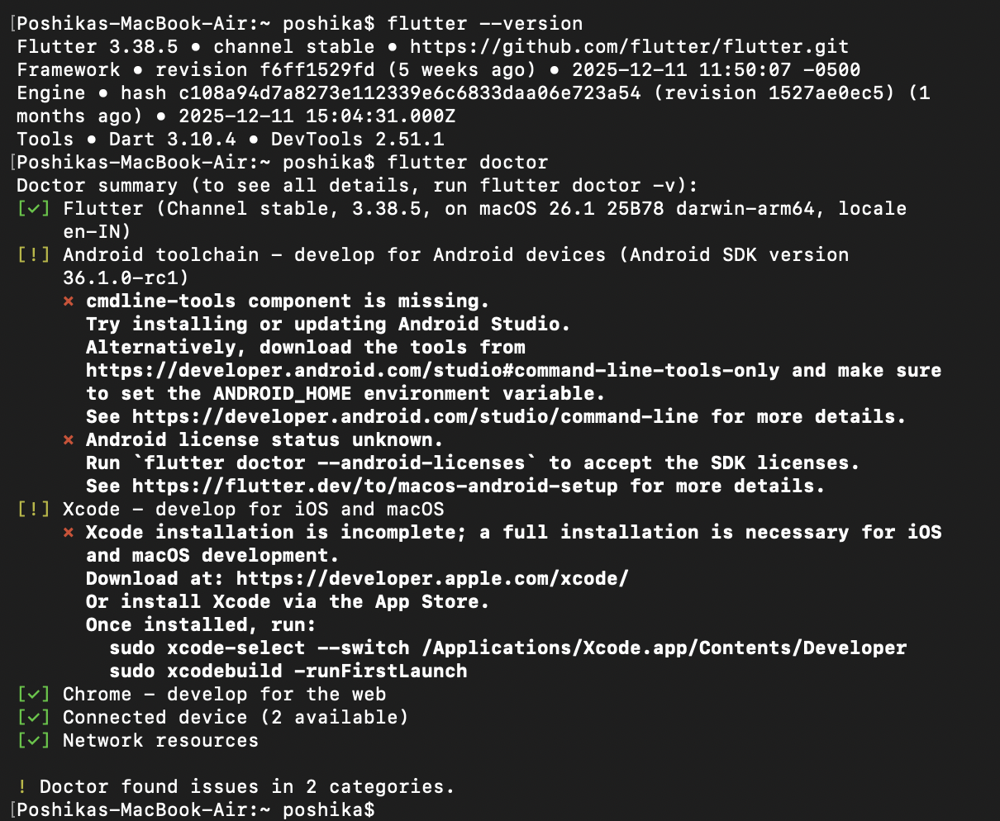

# Setting Up Flutter SDK, Android Studio, and First Emulator Run

This readme provides evidence of successful Flutter installation and environment setup.  
The steps below were followed to install Flutter, configure the development environment, and run the first Flutter application.

## 1. Flutter SDK Installation

- The Flutter SDK was downloaded from the official Flutter website.
- The SDK was extracted to a local directory.
- The `flutter/bin` directory was added to the system PATH environment variable.
- Installation was verified using the following command:

```bash
flutter doctor
```

This command confirmed that Flutter is correctly installed and highlighted no critical issues in the setup.

### 2. Development Environment Setup

## Android Studio

- Android Studio was installed.

- The following components were enabled:

   -- Android SDK

   -- Android SDK Platform

   -- Android Virtual Device (AVD) Manager

- Flutter and Dart plugins were installed via Plugins → Marketplace.

- Did it in VS code

### 3. Emulator Configuration

- An Android Virtual Device was created using AVD Manager.

- Emulator was launched successfully.

- Device detection was verified using:

```bash
flutter devices
```

### 4. Flutter Application
The project was opened in the IDE and executed using:

```bash
flutter run
```

The default Flutter counter application launched successfully on the Android emulator.

### Screenshots

Flutter Doctor Output


Flutter Application Running
