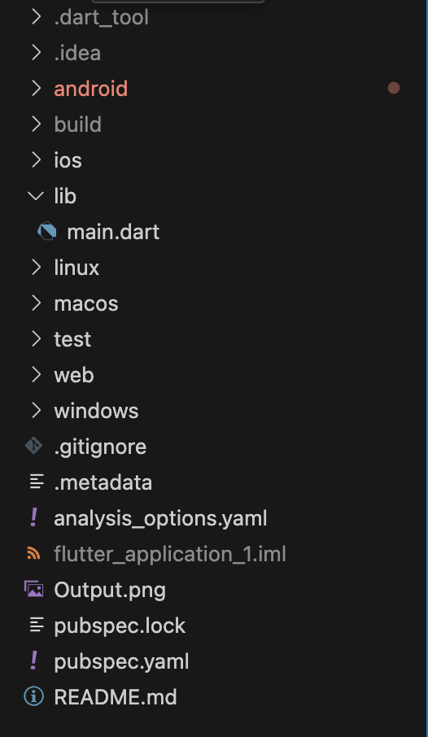

## Project Structure Overview
This project follows Flutter’s standard folder structure.
The purpose of each folder and file is explained in detail in the `PROJECT_STRUCTURE.md` file.

## Importance of Folder Structure
Understanding the project structure helps in organizing code properly,
avoiding errors, and making collaboration easier in team-based projects.

## Screenshot

