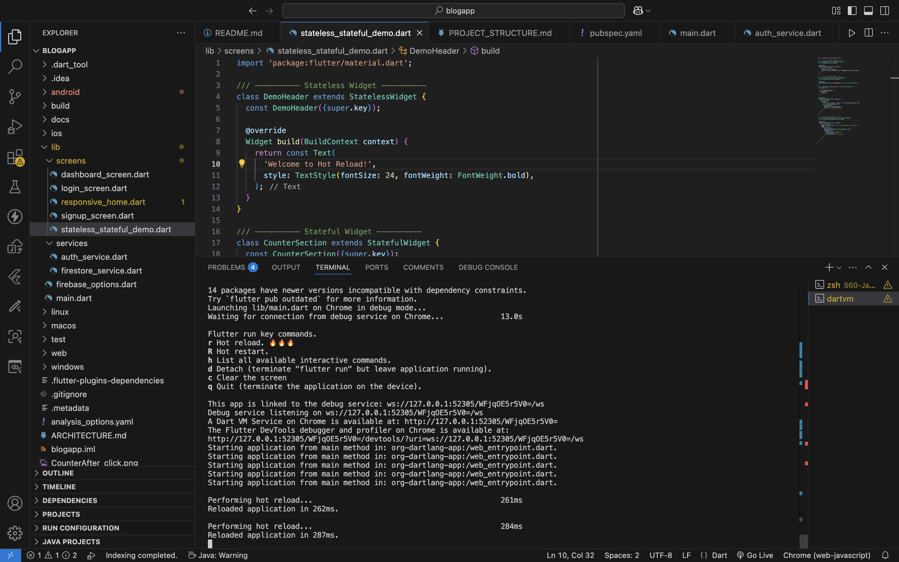
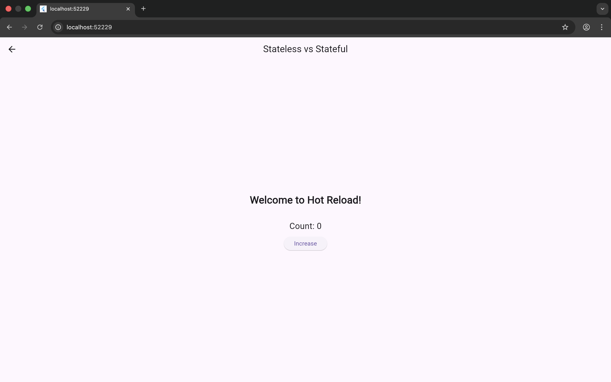
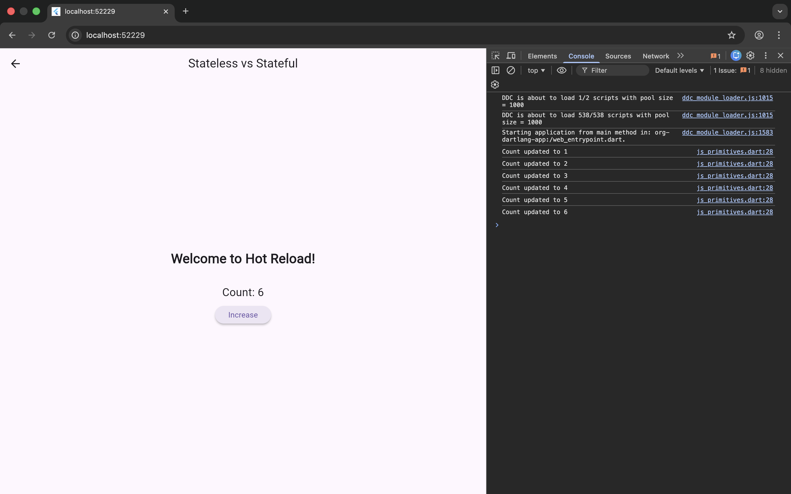

# Using Hot Reload, Debug Console, and Flutter DevTools Effectively

## Description
This project demonstrates Flutter Hot Reload, Debug Console logging,
and Flutter DevTools for efficient development.

## Hot Reload
- App was run using flutter run
- UI text was changed
- Hot Reload applied without restarting the app

## Debug Console
- debugPrint() used to log counter updates
- Logs were visible during runtime

## Flutter DevTools
- Widget Inspector used to inspect widget tree
- UI components highlighted interactively

## Screenshots

Hot Reload Terminal

Before Hot Reload

HotReloadOutput

Debug Console

## Reflection
Hot Reload improves productivity by instantly applying UI changes.
Flutter DevTools helps debug and optimize applications effectively.