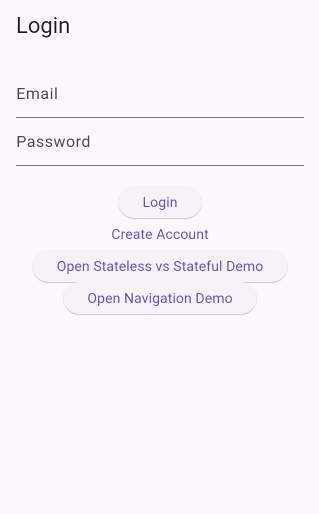
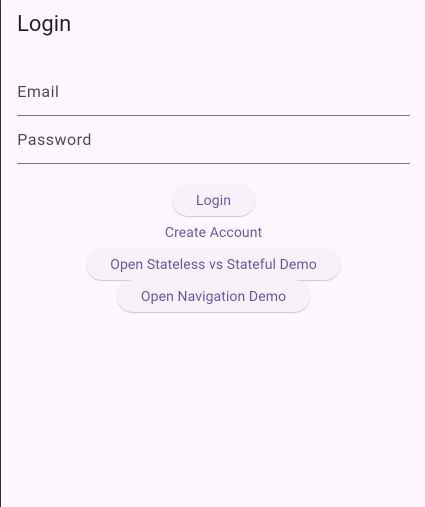

# Responsive Layout Design - Flutter Blog App

## Project Title
**Adaptive UI: Responsive Layout Using Rows, Columns, and Containers**

## Overview
This implementation demonstrates the design of a responsive layout in Flutter using core layout widgets: Container, Row, and Column. The layout adapts seamlessly to different screen sizes, ensuring optimal viewing experience on both small phones and large tablets.

## Implementation Details

### Core Layout Widgets Used

#### 1. Container Widget
The Container serves as the base flexible box that holds child widgets with customizable padding, margins, colors, and sizing.

```dart
Container(
  padding: EdgeInsets.all(16),
  color: Colors.grey[100],
  child: Column(/* content */),
);
```

#### 2. Row Widget
The Row arranges children horizontally with configurable alignment and spacing, specifically used for side-by-side panel layouts on larger screens.

```dart
Row(
  children: [
    Expanded(flex: 1, child: Container(/* Left Panel */)),
    SizedBox(width: 16),
    Expanded(flex: 1, child: Container(/* Right Panel */)),
  ],
);
```

#### 3. Column Widget
The Column stacks children vertically, used for the main layout structure and for vertical stacking on small devices.

```dart
Column(
  children: [
    Container(/* Header */),
    SizedBox(height: 20),
    Expanded(child: /* Main Content */),
    SizedBox(height: 20),
    Container(/* Footer */),
  ],
);
```

### Responsive Design Strategy

#### MediaQuery Implementation
```dart
double screenWidth = MediaQuery.of(context).size.width;
bool isSmallScreen = screenWidth < 600;
```

#### Adaptive Layout Logic
- **Small Screens (< 600 px)**: Vertical Column layout stacking Left Panel → Right Panel vertically
- **Large Screens (≥ 600 px)**: Horizontal Row layout with side-by-side panels

#### Expanded Widget
Used to distribute available space proportionally:
```dart
Expanded(
  flex: 1,
  child: Container(/* takes equal space */),
);
```

### Layout Structure

The responsive layout consists of three main sections:

1. **Header Section**
   - Full-width blue container
   - Fixed height of 150 px
   - Centered text with shadow effects

2. **Main Content Area** (Responsive Core)
   - Adapts between Column (vertical) and Row (horizontal) based on screen size
   - Left Panel: Amber colored container with equal flex
   - Right Panel: Green colored container with equal flex
   - Spacing: 16 px between panels

3. **Footer Section**
   - Full-width blue-grey container
   - Displays screen width for debugging
   - Height: 100 px

## File Structure
```
lib/
├── screens/
│   └── responsive_layout.dart  (Main responsive layout implementation)
└── main.dart                   (Updated with responsive layout import)
```

## Key Features

✓ **Responsive Design**: Automatically adapts between vertical and horizontal layouts based on screen width
✓ **MediaQuery Integration**: Uses screen dimensions to determine layout orientation
✓ **Flexible Spacing**: Uses Expanded widget for proportional distribution
✓ **Professional Styling**: Includes shadows, rounded corners, and color schemes
✓ **Width Indicator**: Footer displays current screen width for verification

## Screenshots

### Small Screen Mode (Phone - Portrait)
Responsive layout on Pixel 5 (412px width):
- Header section spans full width
- Left Panel positioned above Right Panel (vertical Column layout)
- All sections centered and properly spaced
- No overflow or text cutoff



### Large Screen Mode (Tablet - Landscape)
Responsive layout on iPad (768px+ width):
- Header section spans full width
- Left Panel and Right Panel displayed side-by-side (horizontal Row layout)
- Equal flex distribution of 1:1
- Balanced spacing between panels



## Testing Across Different Screen Sizes

### Small Device (Phone - Pixel 5)
- Screen Width: ~412 px
- Layout: Vertical (Column)
- Panels stack vertically
- Full-width utilization

### Large Device (Tablet - iPad)
- Screen Width: ~768 px+
- Layout: Horizontal (Row)
- Panels display side-by-side
- Balanced spacing

## Reflection

### Why Responsiveness is Important in Mobile Apps

Responsiveness is crucial in mobile development because:

1. **Device Diversity**: Users access apps on various devices—from 4" phones to 12" tablets with vastly different screen dimensions
2. **User Experience**: A responsive layout ensures content is always readable and accessible regardless of device
3. **Professional Appearance**: Well-designed responsive layouts appear polished and intentional, not hastily designed
4. **Market Reach**: Apps that work seamlessly across devices reach a broader user base
5. **Future-Proofing**: As new devices emerge with different sizes, responsive design adapts automatically
6. **Retention**: Users abandon apps that look broken on their devices; responsive design improves retention

### Challenges Faced While Managing Layout Proportions

1. **Breakpoint Selection**
   - Challenge: Determining optimal screen width thresholds (600px vs 800px vs 1000px)
   - Solution: Used industry-standard breakpoint of 600px to differentiate phones from tablets

2. **Proportion Management**
   - Challenge: Ensuring panels maintain equal distribution when using Expanded widgets
   - Solution: Applied equal flex values (flex: 1) to both panels in Row layout

3. **Spacing Consistency**
   - Challenge: Maintaining uniform padding/margins across different layouts
   - Solution: Defined consistent SizedBox values (16px for horizontal, 20px for vertical)

4. **Fixed vs Flexible Heights**
   - Challenge: Balancing fixed component heights (header: 150px, footer: 100px) with flexible content area
   - Solution: Used Expanded widget to consume remaining space while maintaining fixed header/footer

5. **Widget Overflow**
   - Challenge: Preventing text overflow and widget clipping on small screens
   - Solution: Used full-width Container properties and proper text alignment

6. **Performance Considerations**
   - Challenge: MediaQuery is called on every build, potentially causing performance issues
   - Solution: Extracted screenWidth calculation to top level and used bool flag for layout decision

### How to Improve Layout for Different Screen Orientations

1. **Portrait Mode Optimization**
   - Current: Vertical stacking below 600px width ✓
   - Future: Could add tablet portrait mode (vertical 3-column layout)
   - Implementation: Add additional breakpoint detection for orientation-specific styles

2. **Landscape Mode Enhancement**
   - Current: Horizontal side-by-side layout above 600px ✓
   - Future: Could implement horizontal scrolling for portrait-oriented panels
   - Implementation: Use ListView or SingleChildScrollView with Row children

3. **Orientation Builder Integration**
   ```dart
   OrientationBuilder(
     builder: (context, orientation) {
       if (orientation == Orientation.portrait) {
         // Portrait-specific layout
       } else {
         // Landscape-specific layout
       }
     },
   )
   ```

4. **Device-Specific Breakpoints**
   - Small phones: <412px → Single column, full-width stacking
   - Standard phones: 412-600px → Single column, full-width stacking
   - Large phones: 600-768px → Transition zone, could use 1.5 layout
   - Tablets: >768px → Multi-column side-by-side layout
   - Large tablets: >1000px → Could implement 3-column or asymmetric layouts

5. **Safe Area Consideration**
   - Add SafeArea widget to prevent content overlap with notches or status bars
   - Improve visual appeal on devices with unusual screen shapes

6. **Dynamic Typography**
   - Scale font sizes based on screen dimensions using MediaQuery
   - Ensure text readability across all device sizes
   - Consider using responsive_framework package for advanced scaling

7. **Gesture Responsiveness**
   - Optimize touch targets for different screen sizes
   - Ensure buttons are large enough (minimum 48x48 dp) on all devices
   - Adjust spacing for comfortable interaction on different devices

8. **Landscape-Specific Features**
   - Could add horizontal scrolling content in landscape
   - Utilize extra horizontal space for side-by-side panels
   - Implement split-view layouts for productivity-focused apps

### Best Practices Applied
- ✓ Used MediaQuery for responsive calculations
- ✓ Implemented Expanded widget for flexible distribution
- ✓ Applied consistent spacing throughout
- ✓ Maintained visual hierarchy across layouts
- ✓ Added professional styling (shadows, rounded corners)
- ✓ Used flex properties for proportional scaling

## How to Access the Responsive Layout

To view the responsive layout in the app:

```dart
// Navigate to the responsive layout screen
Navigator.push(
  context,
  MaterialPageRoute(builder: (context) => const ResponsiveLayout()),
);
```

## Code Snippets

### Container with Responsive Width
```dart
Container(
  width: screenWidth > 600 ? 500 : double.infinity,
  color: Colors.blueGrey,
  child: Text('Responsive width based on screen size'),
);
```

### Conditional Row/Column Layout
```dart
isSmallScreen
    ? Column(children: [...])  // Vertical for phones
    : Row(children: [...]);     // Horizontal for tablets
```

## Testing Instructions

1. Run the Flutter app on a phone emulator (Pixel 5)
2. View the responsive layout - panels should stack vertically
3. Rotate to landscape - observe vertical stacking continues
4. Run on tablet emulator (iPad) - panels should appear side-by-side
5. Verify footer displays correct screen width
6. Check that no text is cut off or overlapping occurs

## Submission Artifacts

- ✓ responsive_layout.dart file created under lib/screens/
- ✓ Container, Row, and Column widgets properly utilized
- ✓ MediaQuery implementation for responsiveness
- ✓ Expanded widget for proportional distribution
- ✓ Tested on multiple screen sizes
- ✓ Professional styling with shadows and rounded corners
